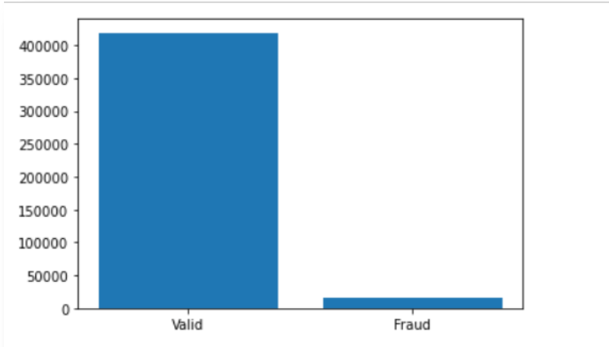
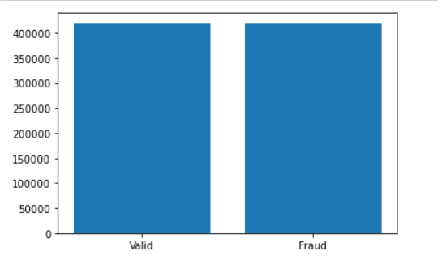

# AIM

- Implement a ‘Transaction Fraud Prevention System’ leveraging machine learning models,
which aims to predict whether a given financial transaction is ‘Fraudulent’ or ‘Valid’.

# REPOSITORY FILE GUIDE

- <b>Name:</b> comp9417_final.py:   <b>Type:</b> Python Script  <b>Description:</b>   Final script submitted for assessment.
- <b>Name:</b> comp9417-unsw.ipynb:  <b>Type:</b> Jupyter Notebook <b>Description:</b>  Intial Exploratory Data Analysis + Data Preprocessing + Decision Tree model.
- <b>Name:</b> corr_pairs_sorted.csv   <b>Type:</b> CSV   <b>Description:</b>  correlation matrix of Transactional dataset features used in selecting the optimal number of features for the dataset for learning and processing optimization. (Sorted)
- <b>Name:</b> corr_pairs.csv    <b>Type:</b> CSV   <b>Description:</b>     correlation matrix of Transactional dataset features used in selecting the optimal number of features for the dataset for learning and processing optimization.
- <b>Name:</b> EDA.ipynb   <b>Type:</b> Jupyter Notebook    <b>Description:</b>  All the exploratory data anaylsis of both the transactional and identity train and test dataset.
- <b>Name:</b> mohitkhanna-comp9417.ipynb <b>Type:</b> Jupyter Notebook <b>Description:</b> Data Preprocessing + Exploratory Data Analysis + Light Gradient Boost Machine (LGBM) model + Random Tree Model + Decision Tree Model + Bernouli Naive Bias Model + extreme gradient Boosting Model (XGB).
- <b>Name:</b> submission.csv  <b>Type:</b> CSV    <b>Description:</b> One of the submission file generated to submit to kaggle competition.

# DATASET

- The dataset for the model was taken from the Kaggle competition: https://www.kaggle.com/c/ieee-fraud-detection and
was provided via the collaboration of IEEE and Vesta Corporation.

## TRANSACTION TABLE

- TransactionDT: timedelta from a given reference datetime (not an actual timestamp).
- TransactionAMT: transaction payment amount in USD.
- (*) ProductCD: product code -> the product for each transaction. (categorical feature)
- (*) [card1, card2, card3, card4, card5, card6] : payment card information For example card type, card category, issue bank, country, etc. (categorical feature)
- (*) addr1: address. (categorical feature)
- (*) addr2: address. (categorical feature)
- dist: distance.
- (*) P_emaildomain: Purchaser email domain. (categorical feature)
- (*) R_emaildomain: Recipient email domain. (categorical feature)
- [C1,C2,C3,C4,C5,C6,C7,C8,C9,C10,C11,C12,C13,C14]: The actual meaning is masked but can be said as a count such as how many addresses are found to associated with the payment card.
- [D1,D2,D3,D4,D5,D6,D7,D8,D9,D10,D11,D12,D13,D14,D15]: timedelta in days between previous transaction.
- (*) [M1,M2,M3,M4,M5,M6,M7,M8,M9]: match such as names on card and address etc. (categorical feature)
- Vxxx: Vesta engineered rich features such as ranking, counting and other entity relations.

## IDENTITY TABLE

- The field names are masked for privacy protection and contract agreement as part fo Vesta's policies.

- Mostly fields are related to identity information such as network connection information.

### CATEGORICAL FEATURES
- DeviceType.
- DeviceInfo.
- id_12 - id_38.

<b>Note:</b> Credit to Vesta (Competition Host) for providing the above data description and details. Link: https://www.kaggle.com/c/ieee-fraud-detection/discussion/101203

# IMPLEMENTATION

## SUMMARY

- After solving class imbalance, leveraging feature selection and Exploratory Data Analysis, we executed tested the
following models for the given data:
    1) Decision Tree: This was our baseline model.
    2) Bernoulli Naive Bayes.
    3) K-Nearest Neighbour.
    4) SVM: We could not get the conclusive answer via the SVM.
    5) Random Forest.
    6) Light Gradient Boost.
    7) Integrated Stacked Model.

- The final model is an LGB model with hyper parameter tuning giving the Kaggle Score of 93.

## EDA

For exploratory data anaylsis please refer to Final_Report_COMP9417_Project.pdf and EDA.ipynb file in this repository

## FEATURE ENGINEERING

###  SOLVING CLASS VARIABLE IMABALANCE USING SIMULATED MINORITY OVER-SAMPLING:

Above image shows the original distribution between the fraud and valid transactions

Approaches considered to solve the class imbalance are minority over sampling and majority over sampling.

Majority under sampling appraoch wass rejected since there could be a possiblity of losing important information.

We used Synthentic Minority Ovver Sampling (SMOTE) and the details are mentioned in the report and the notebook.

####  RESULT AFTER SMOTE

Since the dataset has over 400 features so we used correlation matrix, graphs created in the exploratory data analysis and result in the end was the most relevant features of the dataset. We also as a part of this process, we used sklearn's RFECV for a recursive feature elimation to get the optimal features of this dataset.

<table style = "width:100%">

<tr>
  <th>Feature Selection</th>
  <th>Parameters</th>
</tr>

<tr>
  <td>RFECV</td>
  <td>BernoulliNB(), step = 15,  scoring = 'roc_auc', ev = 5, verbose = 1, n_jobs = 3</td>
</tr>

</table>

## MACHINE LEARNING MODELS

### Decision Tree:

<table style="width:100%">

<tr>
    <th>Model/Scenario</th>
    <th>Parameters</th>
    <th>Kaggle Score</th>
</tr>

<tr>
  <td>Label encoding, Features\Columns with 50 percent or more null values removed, Balance of the class variable</td>
  <td>random_state = 0, criterion = 'entropy', max_depth = 8, splitter = 'best', min_samples_split = 30</td>
  <td>0.69</td>
</tr>

<tr>
  <td>One hot encoding, Features\Columns with 90 percent or more null values removed, Balance of the class variable</td>
  <td>random_state = 0, criterion = 'entropy', max_depth = 8, splitter = 'best', min_samples_split = 30</td>
  <td>0.70</td>
</tr>

<tr>
  <td>Label encoding, Features\Columns with 90 percent or more null values removed, Imbalance of the class vaiable</td>
  <td>random_state = 0, criterion = 'entropy', max_depth = 8, splitter = 'best', min_samples_split = 30</td>
  <td>0.72</td>
</tr>

<!-- <tr>
  <td>One hot encoding, Features\Columns with 90 percent or more null values removed, Imbalance of the class variable</td>
  <td>random_state = 0, criterion = 'entropy', max_depth = 8, splitter = 'best', min_samples_split = 30</td>
  <td>FILL THIS PLEASE</td>
</tr> -->

</table>

### Naive Bias: (check this from notebook)

<table style = "width:100%">

<tr>
  <th>Model/Scenrio</th>
  <th>Kaggle Score</th>
</tr>

<tr>
  <td>Class variable is imbalance</td>
  <td>0.50</td>
</tr>

<tr>
  <td>Class variable is balance and no parameter tuning</td>
  <td>0.63</td>
</tr>

#### Class variable is balance and grid search is utilized to fine tune the hyper parameters.

##### Grid Search Parameters

<table style = "width:100%">
  
  <tr>
    <th>Parameter</th>
    <th>Value(s)</th>
  </tr>

  <tr>
    <td>alpha</td>
    <td>[0.001,0.01,0.1,1]</td>
  </tr>

  <tr>
    <td>Fit_prior</td>
    <td>[True]</td>
  </tr>

</table>

</table>

<table style = "width:100%">

  <tr>
    <td>Grid Search and Feature Selection</td>
    <td>0.75</td>
  </tr>

</table>

### K Nearest Neighbour

<table style = "width:100%">

<tr>
  <th>Hyperparameters</th>
  <th>Kaggle Score</th>
</tr>

<tr>
  <td>N_neigbours = 3, metric = "minkowski" with p = 2</td>
  <td>0.50</td>
</tr>

</table>

<table style = "width:100%">

<tr>
  <th>Hyperparameters</th>
  <th>Kaggle Score</th>
</tr>

<tr>
  <td>N_neigbours = 5, metric = "minkowski" with p = 2</td>
  <td>0.50</td>
</tr>

<tr>
  <td>N_neigbours = 7, metric = "minkowski" with p = 2</td>
  <td>0.50</td>
</tr>

</table>

#### SelectKBest (Sklearn)

<table style = "width:100%">

<tr>
  <th>Hyperparameters</th>
  <th>Value(s)</th>
</tr>

<tr>
  <td>Score_func</td>
  <td>f_classif</td>
</tr>

<tr>
  <td>K</td>
  <td>20</td>
</tr>

</table>

<table style = "width:100%">

<tr>
  <th>Hyperparameters</th>
  <th>Kaggle Score</th>
</tr>

<tr>
  <td>N_neigbours = 5, metric = "minkowski" with p = 2</td>
  <td>0.67</td>
</tr>

</table>

### SUPPORT VECTOR MACHINE

We could not get a conclusive answer for the SVM.

### RANDOM FOREST

<table style = "width:100%">

<tr>
  <th>Hyperparameters</th>
  <th>Kaggle Score</th>
</tr>

<tr>
  <td>'n_estimators' = 100</td>
  <td>0.85</td>
</tr>

<tr>
  <td>'n_estimators' = 500, 'random_state' = 10, 'max_depth' = 20</td>
  <td>0.82</td>
</tr>

<tr>
  <td>'n_estimators' = 1000, 'random_state' = 200, 'bootstrap' = False, 'max_depth' = 5</td>
  <td>0.86</td>
</tr>

<tr>
  <td><b>'n_estimators' = 1000, 'random_state' = 121, 'min_samples_split' = 2, 'bootstrap' = False, 'max_depth' = 5</b></td>
  <td><b>0.88</b></td>
</tr>

</table>

### LIGHT GRADIENT BOOST MACHINE

<table style = "width:100%">

<tr>
  <th>Hyperparameters</th>
  <th>Kaggle Score</th>
</tr>

<tr>
  <td>'objective' = 'binary', 'n_estimators' = 300, 'learning_rate' = 0.1, 'subsample' = 0.8</td>
  <td>0.84</td>
</tr>

<tr>
  <td>'objective' = 'binary', 'n_estimators' = 200, 'learning_rate' = 0.1</td>
  <td>0.83</td>
</tr>

<tr>
  <td>'objective' = 'binary', 'n_estimators' = 500, 'learning_rate' = 0.1</td>
  <td>0.87</td>
</tr>

<tr>
  <td>'objective' = 'binary', 'n_estimators' = 500, 'learning_rate' = 0.1, 'num_leaves' = 50, 'max_depth' = 7, 'subsample' = 0.9, 'colsample_bytree = 0.9'</td>
  <td>0.89</td>
</tr>

<tr>
  <td>'objective' = 'binary', 'n_estimators' = 600, 'learning_rate' = 0.1, 'num_leaves' = 50, 'max_depth' = 7, 'subsample' = 0.9, 'colsample_bytree' = 0.9</td>
  <td>0.90</td>
</tr>

<tr>
  <td><b>'objective' = 'binary', 'n_estimators' = 700, 'learning_rate' = 0.1, 'num_leaves' = 50, 'max_depth' = 7, 'subsample' = 0.9, 'colsample_bytree' = 0.9, 'random_state' = 108</b></td>
  <td><b>0.92</b></td>
</tr>

</table>

### INTEGRATED STACKED MODEL

<table style = "width:100%">

  <tr>
    <th>Hyperparameters</th>
    <th>Kaggle Score</th>
  </tr>

  <tr>
    <td>Decision Tree + K-Nearest Neighbour + Light Gradient Boost Machine + Random Forest + Bernouli Naive Bias</td>
    <td>0.78</td>
  </tr>

</table>

# RESULTS

<table style="width:100%">
  
  <tr>
    <th>Model</th>
    <th>Parameters</th>
    <th>Kaggle Score</th>
  </tr>

  <tr>
    <td>Decision Tree</td>
    <td>random_state = 0, criterion = 'entropy', max_depth = 30, splitter = 'best', min_samples_split = 30</td>
    <td>0.70</td>
  </tr>

  <tr>
    <td>Naive Bayes</td>
    <td>Alpha = 0.01, prior_class = True</td>
    <td>0.75</td>
  </tr>

  <tr>
    <td>K Nearest Neighbour</td>
    <td></td>
    <td>0.67</td>
  </tr>

  <tr>
    <td>Random Forest</td>
    <td>n_estimators = 1000, random_state = 121, min_samples_split = 2, bootstrap = False, max_depth = 5</td>
    <td>0.87</td>
  </tr>

  <tr>
    <td><b>Light Gradient Boosting Machine</b></td>
    <td><b>objective = binary, n_estimators = 700, learning_rate = 0.1, num_leaves = 50, max_depth = 7, subsample = 0.9, colsample_bytree = 0.9, random_state = 108</b></td>
    <td><b>0.92</b></td>
  </tr>

  <tr>
    <td>Integrated Stacked Model</td>
    <td>Decision Tree + Naive Bayes + K-Nearest Neighbour + Random Forest + Light Gradient Boosting Machine</td>
    <td>0.77</td>
  </tr>

</table>

<b>* Light Gradient Boost Machine was chosen as the final model with the final prediction score of 0.92</b>

# CONTRIBUTORS

- Usama Sadiq. (Github Profile: https://github.com/usama-sadiq)
- Mohit Khanna. (Github Profile: https://github.com/mohitKhanna1411)
- Uttkarsh Sharma. (Github Profile: https://github.com/khaamosh)
- Sibo Zhang. (Github Profile: https://github.com/sibozhang400)